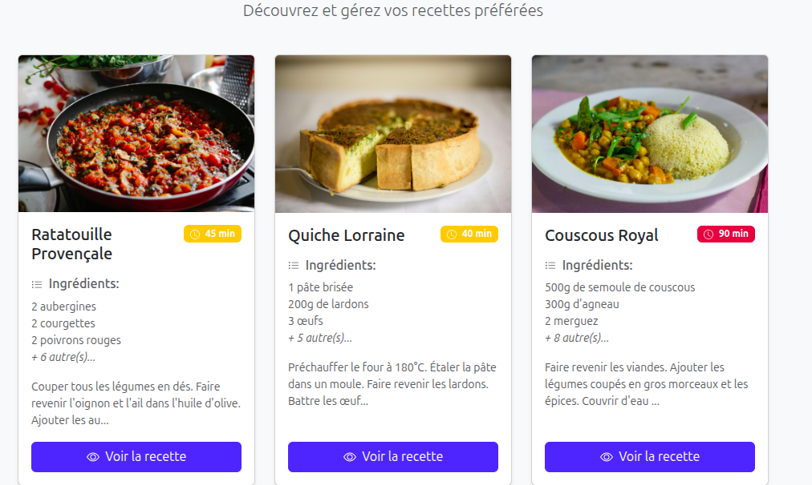

# README

Examen 2526-S9-Développement Web Avancé

# Examen Pratique - API REST avec Node.js et Express

## 📋 Informations Générales

**Durée recommandée :** 2 heures  
**Type :** Examen pratique individuel  
**Objectif :** Compléter les méthodes d'un contrôleur pour créer une API REST fonctionnelle de gestion de recettes

---

## 🎯 Objectifs d'Apprentissage

À la fin de cet examen, vous aurez démontré votre capacité à :

- ✅ Manipuler les requêtes HTTP (GET, POST, PUT, DELETE)
- ✅ Utiliser les paramètres de route (`req.params`) et le corps de requête (`req.body`)
- ✅ Manipuler des données avec les méthodes de tableaux JavaScript
- ✅ Gérer les codes de statut HTTP appropriés
- ✅ Implémenter une logique métier pour un CRUD complet
- ✅ Lire et écrire des données dans un fichier JSON

---

## 📁 Structure du Projet

```text
exam-fullstack-recipes/
├── backend/
│   ├── controllers/
│   │   └── recipesController.js    ← Avec TODOs backend
│   ├── routes/
│   │   └── recipes.js              ← Fourni complet
│   ├── helpers/
│   │   └── index.js                ← Fourni complet
│   ├── data/
│   │   └── recipes.json            ← Données de test
│   ├── server.js                   ← Fourni complet
│   └── package.json
│
├── frontend/
│   ├── index.html                  ← Fourni complet (liste)
│   ├── recipe.html                 ← Fourni complet (détail)
│   ├── js/
│   │   ├── api.js                  ← TODOs: fetch calls
│   │   ├── ui.js                   ← Fourni complet
│   │   ├── main.js                 ← TODOs: orchestration index
│   │   └── recipeDetail.js         ← TODOs: orchestration détail
│   └── css/
│       └── custom.css              ← Fourni: ajustements mineurs
│
└── README.md                       ← Instructions examen
```

---

## 🚀 Instructions de Démarrage

### 1. Installation

```bash
# Installer les dépendances
npm install

# Lancer le serveur en mode développement
npm run dev
```

Le serveur démarre sur `http://localhost:3000`

### 2. Tester l'API

Vous pouvez tester votre API avec :

- **Postman** (recommandé)
- **Thunder Client** (extension VS Code)
- **curl** (ligne de commande)
- **REST Client** (extension VS Code)

---

## 📝 Votre Mission

Vous devez compléter **5 méthodes** dans le fichier `controllers/recipesController.js` :

### ✅ Méthode 1 : `getRecipes()`

**DÉJÀ COMPLÈTE - Utilisez-la comme exemple de référence**

### 🔨 Méthode 2 : `getRecipeById()`

**Difficulté : ⭐ Facile**

Récupérer une recette spécifique par son ID.

**Endpoint :** `GET /api/recipes/:id`

**Critères de réussite :**

- ✅ Retourne la recette si elle existe (status 200)
- ✅ Retourne une erreur 404 si la recette n'existe pas
- ✅ L'ID est correctement converti en nombre

**Exemple de test :**

```bash
GET http://localhost:3000/api/recipes/1
```

---

### 🔨 Méthode 3 : `createRecipe()`

**Difficulté : ⭐⭐ Moyen**

Créer une nouvelle recette.

**Endpoint :** `POST /api/recipes`

**Critères de réussite :**

- ✅ Génère un ID unique avec `Date.now()`
- ✅ Ajoute la recette au tableau
- ✅ Sauvegarde les modifications dans le fichier JSON
- ✅ Retourne la recette créée avec status 201

**Exemple de test :**

```json
POST http://localhost:3000/api/recipes
Content-Type: application/json

{
  "name": "Crêpes",
  "ingredients": ["250g farine", "3 œufs", "500ml lait"],
  "instructions": "Mélanger tous les ingrédients...",
  "prepTime": 30
}
```

---

### 🔨 Méthode 4 : `updateRecipe()`

**Difficulté : ⭐⭐⭐ Moyen-Difficile**

Mettre à jour une recette existante.

**Endpoint :** `PUT /api/recipes/:id`

**Critères de réussite :**

- ✅ Trouve la recette par son ID
- ✅ Retourne 404 si la recette n'existe pas
- ✅ Fusionne les nouvelles données avec les anciennes
- ✅ Préserve l'ID original
- ✅ Sauvegarde les modifications
- ✅ Retourne la recette mise à jour

**Exemple de test :**

```json
PUT http://localhost:3000/api/recipes/1
Content-Type: application/json

{
  "prepTime": 45
}
```

---

### 🔨 Méthode 5 : `deleteRecipe()`

**Difficulté : ⭐⭐ Moyen**

Supprimer une recette.

**Endpoint :** `DELETE /api/recipes/:id`

**Critères de réussite :**

- ✅ Trouve la recette par son ID
- ✅ Retourne 404 si la recette n'existe pas
- ✅ Supprime la recette du tableau
- ✅ Sauvegarde les modifications
- ✅ Retourne un message de confirmation

**Exemple de test :**

```bash
DELETE http://localhost:3000/api/recipes/1
```

---

### 🌟 BONUS : `searchRecipes()`

**Difficulté : ⭐⭐ Moyen**  
**Optionnel - Pour aller plus loin**

Rechercher des recettes par nom.

**Endpoint :** `GET /api/recipes/search?search=crêpe`

**Critères de réussite :**

- ✅ Filtre les recettes dont le nom contient le terme recherché
- ✅ Recherche insensible à la casse
- ✅ Retourne toutes les recettes si aucun terme de recherche

---

## 🔍 Ressources et Aide-Mémoire

### Méthodes de Tableaux JavaScript Utiles

```javascript
// Trouver un élément
const found = array.find((item) => item.id === searchId)

// Trouver l'index d'un élément
const index = array.findIndex((item) => item.id === searchId)

// Filtrer un tableau
const filtered = array.filter((item) => item.id !== deleteId)

// Ajouter un élément
array.push(newItem)
```

### Codes de Statut HTTP à Utiliser

- `200` : OK (succès général)
- `201` : Created (ressource créée)
- `404` : Not Found (ressource non trouvée)
- `500` : Internal Server Error (erreur serveur)

### Accès aux Données de la Requête

```javascript
// Paramètres d'URL
const { id } = req.params // /recipes/:id

// Query string
const { search } = req.query // /recipes?search=terme

// Corps de la requête
const data = req.body // Données envoyées en JSON
```

### Opérateur Spread (Fusion d'Objets)

```javascript
// Créer un nouvel objet en fusionnant deux objets
const merged = { ...objetExistant, ...nouvellesDonnées }

// Exemple
const recipe = { id: 1, name: "Pizza" }
const updates = { name: "Pizza Margherita" }
const updated = { ...recipe, ...updates }
// Résultat : { id: 1, name: "Pizza Margherita" }
```

---

## ✅ Critères d'Évaluation

Votre code sera évalué selon les critères suivants :

| Critère                                                  | Points |
| -------------------------------------------------------- | ------ |
| **Fonctionnalité** - Le code fonctionne correctement     | 40%    |
| **Codes HTTP** - Utilisation appropriée des status codes | 20%    |
| **Logique métier** - Manipulation correcte des données   | 20%    |
| **Qualité du code** - Lisibilité et structure            | 10%    |
| **Gestion d'erreurs** - Cas limites gérés                | 10%    |
| **BONUS** - Fonctionnalité de recherche                  | +10%   |

### Barème Indicatif

- **GET by ID** : 3 points
- **POST** : 4 points
- **PUT** : 4 points
- **DELETE** : 3 points
- **Codes HTTP corrects** : 3 points
- **Code propre et lisible** : 2 points
- **Gestion d'erreurs** : 1 point
- **BONUS Search** : 2 points

**Total : /20 points** (22 points avec le bonus)

---

## 🚫 Règles Importantes

### ✅ Autorisé

- Consulter la documentation MDN, Express.js
- Utiliser les commentaires TODO comme guide
- Tester votre code avec Postman/Thunder Client
- Regarder la méthode `getRecipes()` comme exemple

### ❌ Interdit

- Copier-coller du code depuis Internet
- Communiquer avec d'autres étudiants
- Utiliser des outils d'IA (ChatGPT, Copilot, etc.)
- Modifier les fichiers helpers ou routes

---

## 💡 Conseils pour Réussir

1. **Lisez tous les commentaires TODO attentivement** - Ils contiennent toutes les étapes nécessaires

2. **Commencez par le plus simple** - Complétez `getRecipeById()` d'abord, puis les autres dans l'ordre

3. **Testez après chaque méthode complétée** - Ne codez pas tout d'un coup, testez progressivement

4. **Faites attention aux types** - Les IDs dans `req.params` sont des strings, pensez à `parseInt()`

5. **Vérifiez les codes de statut** - Un 200 au lieu d'un 201 n'est pas grave, mais montre votre compréhension

6. **Ne paniquez pas si vous bloquez** - Passez à la méthode suivante et revenez plus tard

7. **Le code doit fonctionner** - Un code qui marche vaut mieux qu'un code parfait qui ne marche pas

---

## 🧪 Données de Test Fournies

Le fichier `data/recipes.json` contient déjà quelques recettes :

```json
[
	{
		"id": 1,
		"name": "Spaghetti Carbonara",
		"ingredients": ["pâtes", "œufs", "lardons", "parmesan"],
		"instructions": "Cuire les pâtes. Mélanger les œufs...",
		"prepTime": 20
	},
	{
		"id": 2,
		"name": "Salade César",
		"ingredients": ["laitue", "poulet", "croûtons", "parmesan"],
		"instructions": "Laver la laitue. Griller le poulet...",
		"prepTime": 15
	}
]
```

---

## 📞 Besoin d'Aide Pendant l'Examen ?

Si vous avez une **question de clarification** sur les instructions (pas sur comment coder) :

- Levez la main
- L'enseignant viendra vous voir

**Rappel :** Les questions du type "comment faire X en JavaScript" ne sont pas autorisées. Utilisez la documentation !

---

## 🎓 Après l'Examen

Une fois terminé :

1. ✅ Vérifiez que toutes les méthodes sont implémentées
2. ✅ Testez chaque endpoint au moins une fois
3. ✅ Assurez-vous qu'il n'y a pas d'erreurs de syntaxe
4. ✅ Sauvegardez votre travail
5. ✅ Envoyez votre fichier `recipesController.js` complété

---

## 🌟 Bon Courage !

N'oubliez pas : **la pratique est la meilleure façon d'apprendre le développement web !**

Vous avez toutes les connaissances nécessaires pour réussir cet examen. Faites confiance à ce que vous avez appris et prenez votre temps.

**Bonne chance ! 🚀**

## Affichage des recettes


